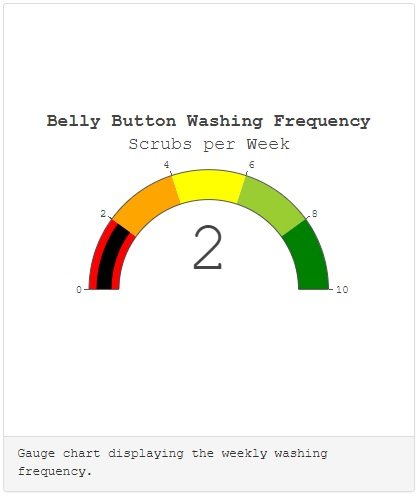

# Belly Button Biodiversity
In this module, we have been utilizing JavaScript, Plotly, and D3.js to create an interactive web application.

## Challenge
For our challenge, we loaded belly button sample data from the [samples](samples.json) file and generated three charts. The data that is used to render the charts is based on the selected subject. Once a subject is selected, the subject demographics information is displayed and the three charts are updated.

The application can be access from the following GitHub Pages link: [Belly Button Biodiversity](https://haldud.github.io/belly-button-biodiversity/)

## Sample Charts

